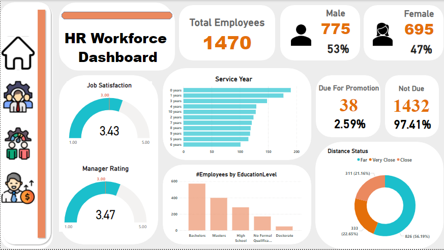

# 🏢 HR Workforce and Attrition Dashboard  

  

## 📋 Overview  
This dashboard provides key insights into HR workforce and attrition metrics, helping organizations monitor employee satisfaction, attrition rates, salaries, and workforce distribution. It enables data-driven decisions to improve employee retention and organizational efficiency.  

---

## 🔑 Key Features  

### **HR Workforce Dashboard**  
1. **Employee Overview**:  
   - Total Employees: **1,470**  
   - Gender Distribution: **53% Male, 47% Female**  
   - Promotion Status: **2.59% due for promotion**  
2. **Satisfaction and Ratings**:  
   - Job Satisfaction: **3.43/5**  
   - Manager Rating: **3.47/5**  
3. **Employee Demographics**:  
   - Education Levels: Bachelor’s, Master’s, High School, etc.  
   - Service Years: Distribution of employees by years of service.  
4. **Distance to Work**:  
   - Majority live **Close (56%)** to the workplace.  

---

### **HR Attrition Dashboard**  
1. **Attrition Rate**: **16%**  
   - Breakdown by departments: **HR (225)**, **Sales (145)**, **Technology (104)**.  
   - Marital Status Influence: **Single (54%)**, Married, Divorced.  
2. **Attrition by Age and Working Years**:  
   - Majority of attrition occurs among employees aged **18-25**.  
   - Most attrition happens within **0-3 years** of work.  
3. **Employee Salaries**:  
   - Total Salary: **166M**  
   - Max Salary: **$547K** (Analytics Manager).  
   - Avg Salary by Department: Technology ($105M), Sales ($53M), HR ($8M).  

---

## 📊 Insights and Analysis  
1. **Job Roles and Ratings**:  
   - Manager and Self Ratings: Monitored for individual job roles.  
   - Work-Life Balance and Relationship Satisfaction are crucial metrics.  
2. **Trends Over Time**:  
   - Total Employees and Salaries tracked over years (2012-2022).  
3. **Departmental Insights**:  
   - Technology contributes the highest total salaries.  
   - HR shows the highest attrition rate.  

---

## 💡 Use Cases  
- **HR Teams**: Monitor employee satisfaction, ratings, and identify potential areas for improvement.  
- **Executives**: Evaluate attrition trends and implement retention strategies.  
- **Recruiters**: Understand salary trends and roles requiring attention.  

---

## 🛠 How to Use  
1. Clone the repository:  
   ```bash
   git clone https://github.com/yourusername/hr-dashboard.git
